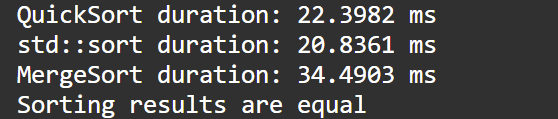

## Lab1 快排算法及其优化

### 算法描述及代码

首先实现了固定基准，即无任何优化的普通版本。完全按照上课讲的伪代码实现，具体如下：

```C++
int Partition(int *A, int p, int r) { // 固定基准
    int x = A[r];
    int i = p-1;
    for(int j=p; j<r; j++) {
        if(A[j] <= x) {
            i++;
            swap(A[i], A[j]);
        }
    }
    swap(A[i+1], A[r]);
    return i+1;
}

void BaseQuickSort(int *A, int p, int r){
    // 基本快排，无优化
    if(p<r) {
        int q = Partition(A, p, r);
        BaseQuickSort(A, p, q-1);
        BaseQuickSort(A, q+1, r);
    }
    return;
}
```

在选取基准方面，实现了随机基准和三数取中两种优化。随机基准通过`std::random_device`和`std::mt19937`初始化随机数种子，在每次分治的数据范围内生成随机数，作为基准。

```C++
int RandomPartition(int *A, int p, int r, std::mt19937 &gen) { // 随机基准
    std::uniform_int_distribution<> dis(p, r);
    int i = dis(gen);
    swap(A[i], A[r]);
    return Partition(A, p, r);
}
```

三数取中方法是每次选取头、尾、中间三个数，选取大小居中这者作为基准，以尽可能使得基准居于数组大小序列的中部。在具体实现中，从语句层级进行了细节上的斟酌，尽量减少了比较和交换的次数。

```C++
int MedianPartition(int *A, int p, int r) { // 三数取中
    int mid = (p+r)/2;
    if (A[p] < A[mid]) {
        if(A[mid] < A[r])
            swap(A[mid], A[r]);
        else if(A[p] >= A[r])
            swap(A[p], A[r]);
    }
    else {
        if(A[mid] >= A[r])
            swap(A[mid], A[r]);
        else if(A[p] < A[r])
            swap(A[p], A[r]);
    }

    return Partition(A, p, r);
}
```

另外实现了插入排序优化，在分治的过程中增加一个边界判断，当边界小于一个值N时，就直接调用插入排序而不再分治。N最终选取值为8，但在一定范围内N的值产生的影响并不大，并且我调整测试的次数不多，因此8很可能并不是最优解。

```C++
void InsertQuickSort(int *A, int p, int r) {
    // 插入排序优化
    if(r-p>K) {
        int q = MedianPartition(A, p, r);
        InsertQuickSort(A, p, q-1);
        InsertQuickSort(A, q+1, r);
    }
    else
        InsertSort(A+p, r-p+1);
    return;
}
```

这里的处理方法是在递归内部增加插入排序的调用。实际上也可以在数组长度较小时直接返回，最后对整体数组进行插入排序。根据理论分析，一方面分开插入排序与合并插入排序进行的具体操作是一致的，另一方面减少了函数调用，因此这种方法应当能提升性能。

另外实现了归并排序，与`std::sort`作为两个对照组，用以评估排序的性能。程序主函数中，首先从文件中读取数据，复制并存放在三个数组中，进行排序时调用`std::chrono`提供的API记录时间并计算耗时。判断三次排序的结果是否相同以确保正确性，并将有序数组输出到指定文件中。最后将耗时打印在控制台上。

### 实验结果及分析



这里采用的快排是未加任何优化的基础版本，可以看到已经显著快于归并排序，稍慢于`std::sort`。采用三数取中优化的快排时间有减少，但仍慢于`std::sort`。采用随机基准的快排并没有优化，甚至增加了耗时。这是由于随机数相关机制的损耗以及随机基准本身的不确定性。

性能最好的快排使用了插入排序优化和三数取中基准。这两种优化可以很好的共存，并且由于三数取中的操作耗费常数时间并且在小数组上优化不显著，因此在这种情况下三数取中能产生的效应要高于只使用三数取中的快排算法。


可以看到，采用这种方法的快排性能已经非常接近于`std::sort`了。